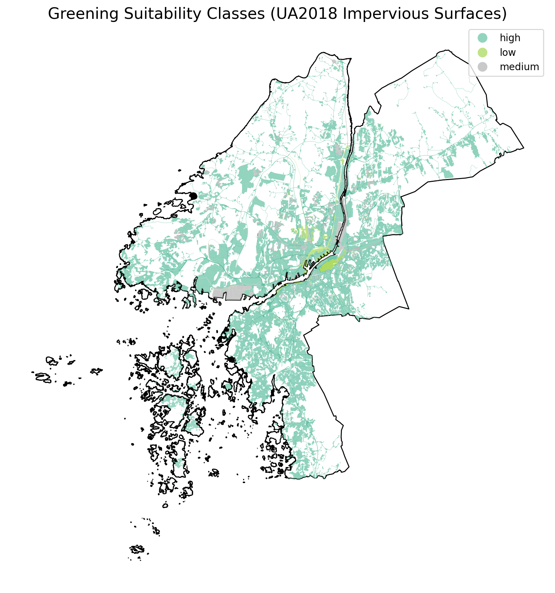

# Impervious to Green  
### A Geospatial Suitability Prototype for Transforming Surfaces in Göteborg  
*Using open data, spatial analysis and ML to identify greening opportunities.*

---

## 1. Overview

Göteborg has been experiencing a long-term loss of vegetation. According to recent
investigations, the city lost vegetation equivalent to **54 football pitches in a single
year**, the largest decline among Nordic municipalities. Satellite-derived indicators
support this trend, showing a persistent reduction in green cover  
(*Expressen, 2025: “Göteborg – en allt gråare stad när växtlighet försvinner”*).
https://www.expressen.se/nyheter/sverige/goteborg-en-allt-graare-stad-nar-vaxtlighet-forsvinner/ 

At the same time, the city is undergoing rapid densification and large construction projects, which in some cases alter its geography for years at a time.
This raises a core question:

> **Where in today’s impervious surfaces could meaningful greening interventions be
realistically introduced?**

This project implements a small but complete analytical prototype to explore this question
using open geospatial data. 

---

## 2. Goals of the Prototype

- Map impervious surfaces in Göteborg using open datasets  
- Extract morphological and contextual features (size, compactness, distances, etc.)  
- Build a transparent, interpretable **suitability score**  
- Train a small ML classifier to test whether the features contain meaningful signal  
- Aggregate results by *stadsområde* for planning-oriented summaries  
- Produce static and interactive maps for spatial interpretation  

This is an **exploratory and diagnostic** prototype, not a prescriptive planning tool.

---

## 3. Data Sources

### Primary geographic layers
- **Urban Atlas 2018** (Copernicus Land Monitoring)  
  - Impervious land-cover polygons  
  - Land-cover classes  
- **Göteborg Stadsområden (administrative boundaries)**  
  - Downloaded from Göteborgs Stad open GIS layers  
- **OpenStreetMap (OSM)** via OSMnx  
  - Major roads and parking areas (used in Notebook 01 for comparison)

### Optional / derived layers
- City centre point (Nils Ericson Terminalen)  
- Water bodies, green areas (from UA)  
- Distance-to-feature layers (via spatial index)

---

## 4. Project Structure

```
impervious-to-green-gbg/
│
├── data/
│ ├── raw/ # UA2018, stadsområden, OSM extracts
│ └── processed/ # unified impervious surfaces, scores, district outputs
│
├── outputs/
│ ├── maps/ # static and interactive suitability maps
│ └── figures/ # notebook images
│
├── notebooks/
│ ├── 01_data_prep.ipynb
│ ├── 02_feature_engineering.ipynb
│ ├── 03_suitability_score.ipynb
│ ├── 04_classifier.ipynb
│ └── 05_district_analysis.ipynb
│
└── README.md
```

---

## 5. Workflow Summary

### **Notebook 01 - Data Preparation**
- Load UA2018 polygons for Göteborg  
- Add OSM road + parking polygons  
- Clip everything to municipal boundary  
- Clean geometry, remove tiny artefacts  
- Export unified impervious dataset  

### **Notebook 02 - Feature Engineering**
Engineered geospatial features such as:

- area and perimeter  
- compactness  
- bounding-box ratio  
- distance to green areas  
- distance to water  
- distance to city centre  
- distance to major roads  
- district assignment (stadsområden)

### **Notebook 03 - Suitability Score**
Created a transparent score combining:

- **Environmental suitability** (proximity to green/water)  
- **Spatial suitability** (distance to centre, distance to traffic)  
- **Morphological suitability** (area, compactness)

Scaled and combined into a **0–1 suitability index**, classified into:

- **high**  
- **medium**  
- **low**  

Static and interactive maps produced.

### **Notebook 04 - ML Classifier Prototype**
A small Random Forest classifier was trained using the engineered features to
predict the suitability class. The aim was to test whether the scoring framework
is internally coherent.

- Achieved ~98% accuracy  
- Feature importances aligned with conceptual expectations  
- Demonstrated that the score is not random but created from meaningful features  

### **Notebook 05 - District-Level Analysis**
Aggregated suitability areas across Göteborg’s four major districts:

| District | % High | % Medium | % Low |
|----------|--------|----------|--------|
| Nordost | 91.7% | 5.8% | 2.5% |
| Centrum | 90.8% | 5.5% | 3.7% |
| Sydväst | 99.7% | 0.2% | 0.08% |
| Hisingen | 83.3% | 12.8% | 3.9% |

---

## 6. Interpreting the Maps

Large parts of Göteborg appear as **high suitability**. This reflects:

- the structure of the Urban Atlas dataset (focus on large polygons)  
- the prevalence of semi-rural and industrial impervious areas  
- the city’s geography (close proximity to green/water in outer districts)  
- the scoring logic, which detects *physical opportunity*, not *urgency*  

This is not an overestimation error, but a consequence of combining:

- outdated land-cover (2018)  
- suburban low-density surfaces  
- a morphology-based suitability model  

A full planning tool would include zoning, ownership, ecological targets,
population exposure, heat stress, or cost modelling.

---

## 7. Visual Outputs

### Static map  


### Interactive map  
The interactive map can be opened via:
(https://hannitomado.github.io/impervious-to-green-gbg/map.html))


It allows zooming, polygon inspection, and suitability exploration.

---

## 8. How to Run the Project

**1. Clone the repository**

```bash
git clone https://github.com/<your-username>/impervious-to-green-gbg.git
cd impervious-to-green-gbg
```

**2. Create environment**

```bash
python -m venv .venv
source .venv/bin/activate    # Windows: .venv\Scripts\activate
pip install -r requirements.txt
```
**3. Run notebooks**

Start Jupyter Lab or VS Code and run the notebooks in order:
01 → 02 → 03 → 04 → 05
All outputs will be written to data/processed/ and outputs/maps/.

---

## 9. Limitations

- Urban Atlas 2018 is outdated for a rapidly transforming city like Göteborg
- Roads and fine-grained pavements are not included in UA impervious surfaces
- The model does not include legal constraints, ownership, costs, or zoning
- Suitability represents opportunity, not urgency
- The ML classifier learns from the internal scoring logic, not real planning labels

## 10. Potential Extensions

- Integrate updated imperviousness maps (ESA WorldCover / Sentinel-2 indices)
- Add climate vulnerability or heat-exposure layers
- Incorporate biodiversity corridors or pollination networks
- Add zoning restrictions and parcel-level ownership
- Train a supervised model on expert-labelled priority sites
- Build a lightweight web dashboard for non-GIS users

---

## 11. Acknowledgements


This prototype was developed as a learning exercise inspired by the goals of
RISE’s Grey to Green project. All data used are open geospatial datasets.

---

## 12. License


MIT License.

